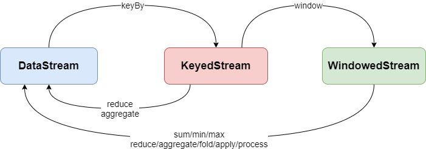

# window相关总结
开窗是是flink中常用的手段，这里总结一下常用的window相关操作,有一点要注意windowf 只能用在keystream流中,对于未分组的流可以使用windowall

## Window 的生命周期
* 窗口在有对应数据到达时创建，在窗口结束时间+允许用户定义的延迟时间结束
* 每个窗口会有一个触发器，当窗口结束后会启动对应的funciton
* 窗口内的元素会在func结束后销毁，生命周期结束

## window类型（window assigner）
负责将每个元素传递给1个后者多个窗口
* 全局窗口：并行度1，所有数据聚合到一起，生产环境基本可不可用
* 滚动窗口：设置固定的时间间隔，窗口之间没有想先
* 滑动窗口：窗口之间有重叠
* session窗口：根据两条消息的间隔时间差判定窗口边界
* 计数窗口：

## 窗口函数
选择合适的计算函数，减少开发代码量提高系统性能

* 增量聚合函数(窗口只维护状态)
    * ReduceFunction
    * AggregateFunction
    * FoldFunction（废弃）
* 全量聚合函数(窗口维护窗口内的数据)
    * ProcessWindowFunction
    * 全量计算
* 增量聚合和全窗口聚合函数配合使用
    *  AggregateFunction(XXX,Iterator<object>  out)
    这里返回的iterator中只有一个元素，增量聚合的结果。通过这种方法把增量函数累计值增加窗口信息
     
     
窗口和算子之间关系

