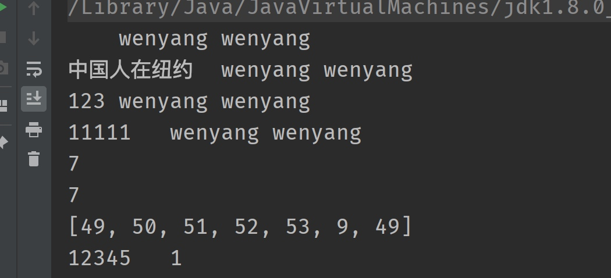
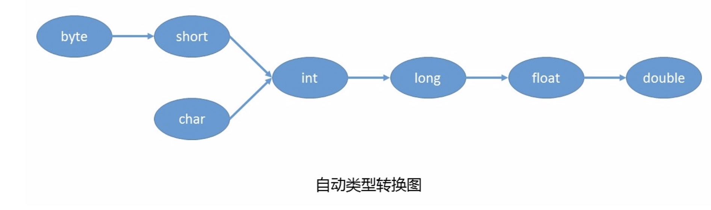
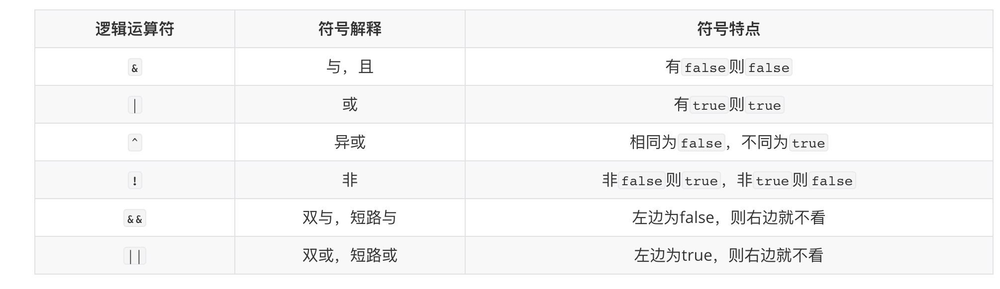

## 基础数据类型

java是一个强类型的语言，数据的类型区分的很详细

### 基础数据类型存储范围
byte:  1个字节  8bit   范围：  -2^7  ~ 2^7 -1    整数 -128~127
short: 2个字节  16bit  范围  -2^15 ~ 2^15 -1
int：  4个字节  32bit   
long:8个字节    64bit
float: 4个字节  32bit
double：8个字节  64bit
>     java程序中 整型默认是int 如果超过范围需要特别声明为long  即10l
    而小数默认是double， 如果想使用float需要声明为f 即写成 0.1f

###输入输出转义
* \t 长度不一致的原因

```
package com.wenyang.module01;

import java.nio.charset.StandardCharsets;
import java.util.ArrayList;
import java.util.Arrays;

/**
 * Description:
 * <p>
 * Created on 2021/10/11
 *
 * @author wenyangzang
 */
public class ZhuanYi {
    public static void main(String[] args) {
        char c ='1';
        String zhuanyi0="\twenyang\twenyang";

        String zhuanyi1="中国人在纽约\twenyang\twenyang";
        String zhuanyi2="123\twenyang\twenyang";

        StringBuffer stringBuffer = new StringBuffer();
        stringBuffer.append(c).append(c).append(c).append(c).append(c).append(zhuanyi0);
        System.out.println(zhuanyi0);
        System.out.println(zhuanyi1);
        System.out.println(zhuanyi2);
        System.out.println(stringBuffer);

        String tString="12345\t1";
        System.out.println(tString.length());
        try {
            System.out.println(tString.getBytes(StandardCharsets.UTF_8).length);
            System.out.println(Arrays.toString(tString.getBytes(StandardCharsets.UTF_8)));
            System.out.println(tString);

        }catch (Exception e)
        {

        }
    }
}

```

输出内容

会发现\t的代表的长度不一致。
分析原因：是因为\t代表一个指标的的空间，如果有字符占据了部分空间则展示的空白空间就少了

* 一个制表符占据空间多大呢？
8个字符（byte），但是因为字符集编码的问题有时候空间只能展示几个中文字符。具体情况需要在编码这块再仔细研究


### 基本数据类型转换
在Java程序中，不同的基本数据类型的值经常需要进行相互转换。Java语言所提供的**七种数值类型**之间可以相互转换，基本数据类型转换有两种转换方式：自动类型转换和强制类型转换。


#####自动转换
 * 将`取值范围小的类型`自动提升为`取值范围大的类型` 。



（1）当把存储范围小的值（常量值、变量的值、表达式计算的结果值）赋值给了存储范围大的变量时

```java
int i = 'A';//char自动升级为int
double d = 10;//int自动升级为double
```

（2）当存储范围小的数据类型与存储范围大的数据类型一起混合运算时，会按照其中最大的类型运算

``` java
int i = 1;
byte b = 1;
double d = 1.0;
double sum = i + b + d;//混合运算，升级为double
```
（3）当byte,short,char数据类型进行算术运算时，按照int类型处理

``` java
byte b1 = 1;
byte b2 = 2;
byte b3 = b1 + b2;//编译报错，b1 + b2自动升级为int
char c1 = '0';
char c2 = 'A';
System.out.println(c1 + c2);//113 
```
#### 强制类型转换（显示类型转换）
* 将`取值范围大的类型`强制转换成`取值范围小的类型`。
 比较而言，自动转换是Java自动执行的，而强制转换需要我们自己手动执行。
 
``` java
int i = (int)3.14;//强制类型转换，损失精度

double d = 1.2;
int num = (int)d;//损失精度

int i = 200;
byte b = (byte)i;//溢出
```


####除数和余数小练习

```

        int i=1234;
        int j=9;
        int chu=i/j;
        int yu=i%j;
        System.out.println(chu);
        System.out.println(yu);

```

chu=i/j  这里都是整数相除，结果也是整数

如果想计算的到准确值需要在右边等式中一个变量转为double，看下面代码


``` java
        int i=1234;
        int j=9;
        double q = i/j;
        System.out.println(q);
        double q2=(double)i/j;
        System.out.println(q2);
```
结果：
137.0
137.11111111111111

#### 关系运算符
注意：只有基础数据类型能互相比较（byte,char,short,int,long,float,double）

```
        float f1 =1.0f;
        double d1=1.0;
        int i1=1;
        short s1=1;
        char c1='1';
        System.out.println(f1==d1);
        System.out.println(i1==d1);
        System.out.println(s1==d1);
        System.out.println(c1==d1);
```
返回结果

```
true
true
true
false
```
证明double 和int之间可以比较，其实是把int升级到double进行比较了，但是char、byte需要转为asc才能比较


#### 逻辑运算符
逻辑运算符，是用来连接两个布尔类型结果的运算符（`!`除外），运算结果一定是boolean值`true`或者`false`




#### byte和char对比
byte是字节 占8个bit位，更看重存储空间
char是字符 更关注逻辑层面，unicode时一个字符占2个字节


#### 捕捉命令行输入

```
public class Demo1{
	public static void main(String[] args){
		int a=10;
		System.out.println(a);
		java.util.Scanner input=new java.util.Scanner(System.in);
		
		System.out.println("输入一个double数值");
		double num1=input.nextDouble();
		System.out.println(num1+10);
		input.nextLine();//这里必须有一个接收行，接受输入double数据时候的回车
		
		System.out.println("输入名字");
		String name=input.nextLine();
		System.out.println(name);
		
		System.out.println("输入地址");
		String address=input.nextLine();//"89"
		System.out.println(address);
	}
}
```

#### swtich case

```
switch(expression){
    case value :
       //语句
       break; //可选
    case value :
       //语句
       break; //可选
    //你可以有任意数量的case语句
    default : //可选
       //语句
}
```

需要注意几个问题：
		a. case后的值不能相同
		b. case的穿透
		c. switch结束，要么执行完毕，要么遇到break
		d. switch都支持什么数据类型 
			byte short int char String(JDK1.7新增) 
					
		
				

